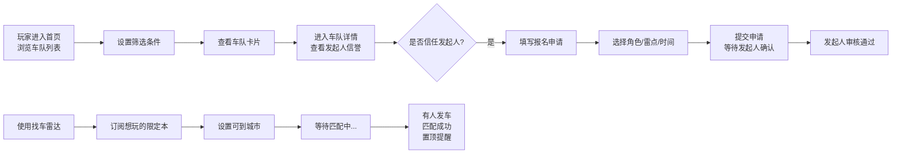
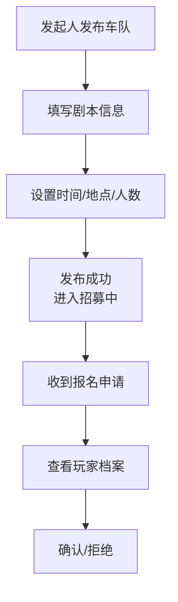

## 1. 产品概述

「城内车库」是面向同城剧本杀玩家的轻社交 Web 看板，专为散人玩家在陌生城市寻找靠谱城限本车队而设计。通过社区互信机制（发起人评价、鸽车记录、常玩风格标签），玩家可以避开群消息刷屏的低效找车模式，高效匹配到质量车队。

### 核心价值
- 解决玩家痛点：微信群消息刷屏导致靠谱车队信息被淹没，散人玩家在陌生城市找不到可信车队
- 解决信任问题：通过历史评价和鸽车记录建立社区信任体系
- 提升匹配效率：按城市、商圈、类型、时间精准筛选

---

## 2. 核心功能

### 2.1 用户角色

| 角色 | 注册方式 | 核心权限 |
|------|----------|----------|
| 普通玩家 | 手机号/微信登录 | 浏览车队、提交报名、发布车队、使用找车雷达 |
| 车队发起人 | 普通玩家升级 | 发布车队、管理报名、确认成员 |

### 2.2 功能模块

1. **首页-城内车库**：筛选器（城市/商圈/剧本类型/开车时间）、车队卡片瀑布流、城市切换
2. **车队详情页**：发起人档案（评价/鸽车记录/常玩风格）、车队信息、报名申请表单
3. **找车雷达**：订阅想打的限定本 + 可到城市，匹配置顶提醒
4. **个人中心**：我的车队、我的报名、个人档案、信誉评分

### 2.3 页面详情

| 页面名称 | 模块名称 | 功能描述 |
|----------|----------|----------|
| 首页-城内车库 | 顶部筛选器 | 城市下拉、商圈多选、剧本类型标签、时间筛选（今日/本周/自定义） |
| 首页-城内车库 | 车队卡片 | 显示是否城限、缺几人、车队氛围标签、发起人头衔、开车时间地点 |
| 车队详情页 | 发起人档案 | 历史评价、鸽车记录、常玩风格标签、信誉评分、已发车次数 |
| 车队详情页 | 报名表单 | 可玩角色多选、雷点标签、可接受结束时间、是否候补 |
| 找车雷达 | 订阅表单 | 想打的限定本名称、可到城市、提醒设置（站内/浏览器通知） |
| 找车雷达 | 匹配列表 | 已订阅本的发车信息、置顶高亮显示、新匹配提醒 |
| 个人中心 | 我的档案 | 昵称、头像、常玩风格、我的评价、鸽车记录 |

---

## 3. 核心流程

---

## 4. 产品目标
**视觉风格定位：侦探事务所档案板（Noir 风格）

### 4.1 设计风格
- **主色调**：深邃炭黑 `#121212` 作为底色，营造神秘探案氛围
- **辅助色**：暖琥珀 `#D4A574` 作为强调色（档案标签、重要信息）
- **点缀色**：暗翡翠绿 `#3D6B5E` 用于状态标识（招募中、已匹配）
- **背景**：做旧纸张纹理 + 细微颗粒质感，模拟侦探事务所档案板
- **按钮风格**：圆角矩形、轻微浮雕质感、悬停时琥珀色光晕
- **字体**：标题使用 Playfair Display（衬线字体，复古侦探小说感），正文使用 Lora 或 Cormorant Garamond
- **布局**：卡片采用档案袋/文件夹风格，边缘微卷，手写体标签
- **图标**：复古侦探元素 - 放大镜、指纹、档案夹、邮票、回形针

### 4.2 页面设计概览

| 页面名称 | 模块名称 | UI 元素 |
|----------|----------|----------|
| 首页-城内车库 | 顶部 Hero | 大字号衬线字体 "今日发车"、做旧纸张纹理背景、城市下拉选择器 |
| 首页-城内车库 | 筛选器 | 标签式筛选，选中时呈琥珀色印章效果 |
| 首页-城内车库 | 车队卡片 | 档案袋造型卡片、城限印章、缺人数徽章、氛围标签（手写体） |
| 车队详情页 | 发起人档案 | 侦探档案布局、指纹图标、鸽车记录用红色印章标注 |
| 车队详情页 | 报名表单 | 打印表单风格、虚线分割线、手写体占位符 |
| 找车雷达 | 订阅区 | 雷达扫描动画、目标锁定效果、匹配成功时绿色高亮闪烁 |
| 个人中心 | 信誉面板 | 星级评分、指纹图标、历史记录时间线 |

### 4.3 动效设计
- **卡片悬停**：轻微上浮 + 琥珀色光晕 + 纸张翻动声效暗示
- **筛选切换**：档案分类抽屉滑入滑出
- **匹配成功**：雷达波扩散动画 + 绿色脉冲
- **页面加载**：打字机效果逐字显示
- **提交成功**：印章盖下动画

### 4.4 响应式
- 桌面端：三栏瀑布流卡片布局
- 平板端：双栏布局
- 移动端：单栏布局，底部导航
- 触摸优化：增大点击区域，滑动切换筛选标签

---

## 5. 车队卡片核心三要素
1. **是否城限**：左上角红色/金色印章，城限本用烫金印章标注
2. **还缺几人**：大号数字徽章，醒目显示
3. **车队氛围**：手写体标签（硬核推理/欢乐撕逼/情感沉浸/恐怖惊悚）

## 6. 报名表单项
1. **可玩角色**：多选，剧本角色列表
2. **雷点**：标签多选（反串/恐怖/情感/喝酒/熬夜）
3. **可接受结束时间**：时间选择器
4. **是否愿意候补**：开关选项
