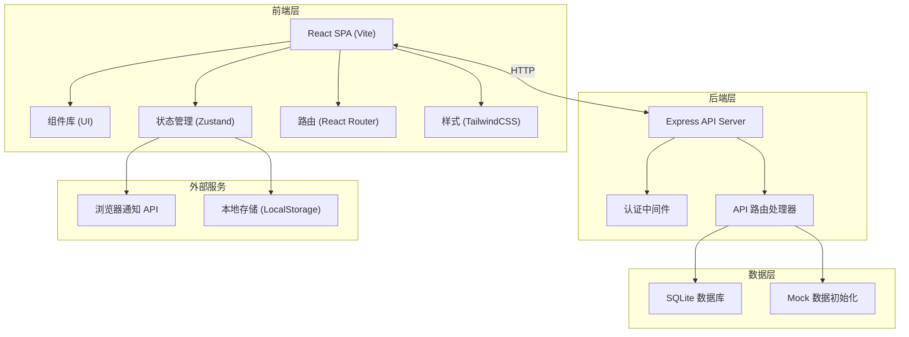
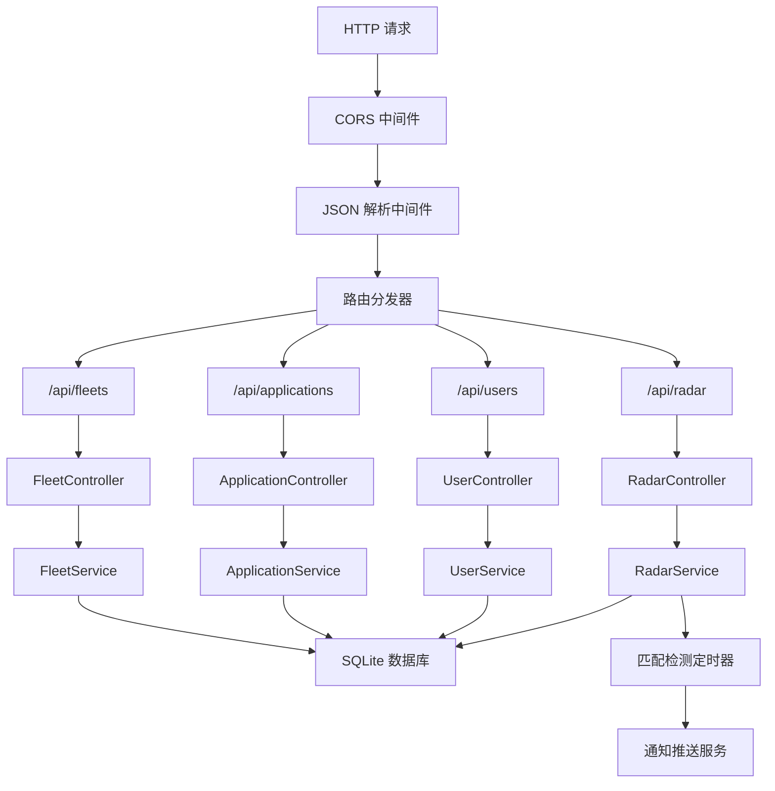
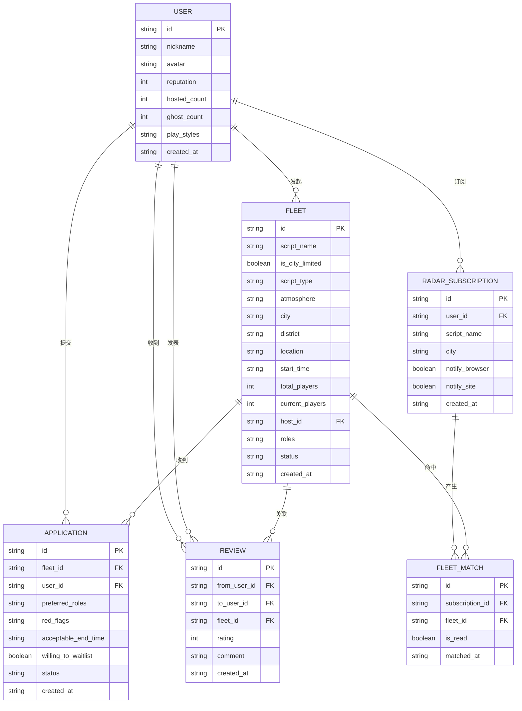

## 1. 架构设计



---

## 2. 技术描述

### 2.1 技术栈
- **前端框架**：React@18 + TypeScript
- **构建工具**：Vite@5
- **后端框架**：Express@4 + TypeScript
- **状态管理**：Zustand@4
- **路由**：React Router DOM@6
- **样式**：TailwindCSS@3
- **图标**：lucide-react
- **数据库**：SQLite (better-sqlite3)
- **包管理器**：pnpm（优先）/ npm

### 2.2 项目初始化
- 使用模板：`react-express-ts`（React + TypeScript + Express）
- 初始化命令：`pnpm create vite-init@latest . --template react-express-ts --force`

### 2.3 项目结构
```
├── src/                    # 前端源码
│   ├── components/         # 可复用组件
│   │   ├── FleetCard.tsx       # 车队卡片
│   │   ├── FilterBar.tsx       # 筛选器
│   │   ├── HostProfile.tsx     # 发起人档案
│   │   ├── ApplicationForm.tsx # 报名表单
│   │   ├── RadarPanel.tsx      # 找车雷达面板
│   │   ├── Header.tsx          # 顶部导航
│   │   └── Layout.tsx          # 布局组件
│   ├── pages/              # 页面组件
│   │   ├── Home.tsx            # 首页-城内车库
│   │   ├── FleetDetail.tsx     # 车队详情页
│   │   ├── Radar.tsx           # 找车雷达页
│   │   └── Profile.tsx         # 个人中心
│   ├── hooks/              # 自定义 Hooks
│   │   ├── useFleets.ts        # 车队数据 Hook
│   │   ├── useRadar.ts         # 雷达订阅 Hook
│   │   └── useNotification.ts  # 通知 Hook
│   ├── store/              # Zustand Store
│   │   ├── useFleetStore.ts    # 车队状态
│   │   ├── useRadarStore.ts    # 雷达订阅状态
│   │   └── useUserStore.ts     # 用户状态
│   ├── utils/              # 工具函数
│   │   ├── mockData.ts         # Mock 数据
│   │   ├── types.ts            # TypeScript 类型
│   │   └── api.ts              # API 封装
│   ├── App.tsx
│   └── main.tsx
├── api/                    # 后端源码
│   ├── index.ts                # 服务器入口
│   ├── routes/                 # API 路由
│   │   ├── fleets.ts           # 车队相关接口
│   │   ├── radar.ts            # 雷达相关接口
│   │   ├── applications.ts     # 报名相关接口
│   │   └── users.ts            # 用户相关接口
│   ├── db/                     # 数据库
│   │   ├── schema.sql          # 建表语句
│   │   └── init.ts             # 初始化脚本
│   ├── middleware/             # 中间件
│   └── types/                  # 后端类型
├── shared/                 # 前后端共享类型
│   └── index.ts
├── migrations/             # 数据库迁移
└── ...配置文件
```

---

## 3. 路由定义

| 路由 | 页面 | 说明 |
|------|------|------|
| `/` | 首页-城内车库 | 车队列表、筛选器 |
| `/fleet/:id` | 车队详情页 | 发起人档案、报名表单 |
| `/radar` | 找车雷达页 | 订阅表单、匹配列表 |
| `/profile` | 个人中心 | 我的车队、报名记录 |
| `/publish` | 发布车队页 | 发布新队表单 |

---

## 4. API 定义

### 4.1 类型定义 (TypeScript)
```typescript
// shared/index.ts
export interface User {
  id: string;
  nickname: string;
  avatar: string;
  reputation: number;
  hostedCount: number;
  ghostCount: number;
  playStyles: string[];
  reviews: Review[];
}

export interface Review {
  id: string;
  fromUserId: string;
  fromUserName: string;
  rating: number;
  comment: string;
  fleetId: string;
  createdAt: string;
}

export interface Fleet {
  id: string;
  scriptName: string;
  isCityLimited: boolean;
  scriptType: string;
  atmosphere: string;
  city: string;
  district: string;
  location: string;
  startTime: string;
  totalPlayers: number;
  currentPlayers: number;
  hostId: string;
  host: User;
  roles: string[];
  status: 'recruiting' | 'full' | 'completed' | 'cancelled';
  createdAt: string;
}

export interface Application {
  id: string;
  fleetId: string;
  userId: string;
  preferredRoles: string[];
  redFlags: string[];
  acceptableEndTime: string;
  willingToWaitlist: boolean;
  status: 'pending' | 'approved' | 'rejected' | 'waitlisted';
  createdAt: string;
}

export interface RadarSubscription {
  id: string;
  userId: string;
  scriptName: string;
  city: string;
  notifyBrowser: boolean;
  notifySite: boolean;
  createdAt: string;
}

export interface FleetMatch {
  subscriptionId: string;
  fleet: Fleet;
  matchedAt: string;
  isRead: boolean;
}
```

### 4.2 API 接口清单

| 方法 | 路径 | 说明 | 请求参数 | 响应 |
|------|------|------|----------|------|
| `GET` | `/api/fleets` | 获取车队列表 | `city`, `district`, `type`, `startTime`, `page` | `Fleet[]` |
| `GET` | `/api/fleets/:id` | 获取车队详情 | - | `Fleet & { host: User }` |
| `POST` | `/api/fleets` | 发布车队 | `FleetCreate` | `Fleet` |
| `POST` | `/api/fleets/:id/applications` | 提交报名 | `ApplicationCreate` | `Application` |
| `GET` | `/api/users/:id` | 获取用户档案 | - | `User` |
| `GET` | `/api/radar/subscriptions` | 获取订阅列表 | - | `RadarSubscription[]` |
| `POST` | `/api/radar/subscriptions` | 新建订阅 | `RadarSubscriptionCreate` | `RadarSubscription` |
| `DELETE` | `/api/radar/subscriptions/:id` | 取消订阅 | - | `{ success: boolean }` |
| `GET` | `/api/radar/matches` | 获取匹配列表 | - | `FleetMatch[]` |
| `PUT` | `/api/radar/matches/:id/read` | 标记已读 | - | `{ success: boolean }` |

---

## 5. 服务器架构图



---

## 6. 数据模型

### 6.1 ER 图



### 6.2 DDL 语句
```sql
-- migrations/001_init.sql
CREATE TABLE IF NOT EXISTS users (
    id TEXT PRIMARY KEY,
    nickname TEXT NOT NULL,
    avatar TEXT,
    reputation INTEGER DEFAULT 100,
    hosted_count INTEGER DEFAULT 0,
    ghost_count INTEGER DEFAULT 0,
    play_styles TEXT,
    created_at TEXT DEFAULT CURRENT_TIMESTAMP
);

CREATE TABLE IF NOT EXISTS fleets (
    id TEXT PRIMARY KEY,
    script_name TEXT NOT NULL,
    is_city_limited INTEGER DEFAULT 0,
    script_type TEXT NOT NULL,
    atmosphere TEXT,
    city TEXT NOT NULL,
    district TEXT,
    location TEXT,
    start_time TEXT NOT NULL,
    total_players INTEGER NOT NULL,
    current_players INTEGER DEFAULT 1,
    host_id TEXT NOT NULL,
    roles TEXT,
    status TEXT DEFAULT 'recruiting',
    created_at TEXT DEFAULT CURRENT_TIMESTAMP,
    FOREIGN KEY (host_id) REFERENCES users(id)
);

CREATE TABLE IF NOT EXISTS applications (
    id TEXT PRIMARY KEY,
    fleet_id TEXT NOT NULL,
    user_id TEXT NOT NULL,
    preferred_roles TEXT,
    red_flags TEXT,
    acceptable_end_time TEXT,
    willing_to_waitlist INTEGER DEFAULT 0,
    status TEXT DEFAULT 'pending',
    created_at TEXT DEFAULT CURRENT_TIMESTAMP,
    FOREIGN KEY (fleet_id) REFERENCES fleets(id),
    FOREIGN KEY (user_id) REFERENCES users(id)
);

CREATE TABLE IF NOT EXISTS reviews (
    id TEXT PRIMARY KEY,
    from_user_id TEXT NOT NULL,
    to_user_id TEXT NOT NULL,
    fleet_id TEXT NOT NULL,
    rating INTEGER NOT NULL,
    comment TEXT,
    created_at TEXT DEFAULT CURRENT_TIMESTAMP,
    FOREIGN KEY (from_user_id) REFERENCES users(id),
    FOREIGN KEY (to_user_id) REFERENCES users(id),
    FOREIGN KEY (fleet_id) REFERENCES fleets(id)
);

CREATE TABLE IF NOT EXISTS radar_subscriptions (
    id TEXT PRIMARY KEY,
    user_id TEXT NOT NULL,
    script_name TEXT NOT NULL,
    city TEXT NOT NULL,
    notify_browser INTEGER DEFAULT 1,
    notify_site INTEGER DEFAULT 1,
    created_at TEXT DEFAULT CURRENT_TIMESTAMP,
    FOREIGN KEY (user_id) REFERENCES users(id)
);

CREATE TABLE IF NOT EXISTS fleet_matches (
    id TEXT PRIMARY KEY,
    subscription_id TEXT NOT NULL,
    fleet_id TEXT NOT NULL,
    is_read INTEGER DEFAULT 0,
    matched_at TEXT DEFAULT CURRENT_TIMESTAMP,
    FOREIGN KEY (subscription_id) REFERENCES radar_subscriptions(id),
    FOREIGN KEY (fleet_id) REFERENCES fleets(id)
);

-- 索引
CREATE INDEX IF NOT EXISTS idx_fleets_city ON fleets(city);
CREATE INDEX IF NOT EXISTS idx_fleets_status ON fleets(status);
CREATE INDEX IF NOT EXISTS idx_fleets_start_time ON fleets(start_time);
CREATE INDEX IF NOT EXISTS idx_matches_subscription ON fleet_matches(subscription_id);
CREATE INDEX IF NOT EXISTS idx_matches_is_read ON fleet_matches(is_read);
```

### 6.3 Mock 数据初始化
```typescript
// api/db/init.ts
import { db } from './index';

export function initMockData() {
  // 5 个示例用户
  const users = [
    { id: 'u1', nickname: '推理迷小王', avatar: '🕵️', reputation: 95, hosted_count: 12, ghost_count: 0, play_styles: JSON.stringify(['硬核推理', '本格']) },
    { id: 'u2', nickname: '情感水龙头', avatar: '🎭', reputation: 88, hosted_count: 8, ghost_count: 1, play_styles: JSON.stringify(['情感沉浸', '古风']) },
    { id: 'u3', nickname: '恐怖坦克', avatar: '👻', reputation: 92, hosted_count: 15, ghost_count: 0, play_styles: JSON.stringify(['恐怖惊悚', '变格']) },
    { id: 'u4', nickname: '欢乐喜剧人', avatar: '🎪', reputation: 90, hosted_count: 6, ghost_count: 2, play_styles: JSON.stringify(['欢乐撕逼', '机制']) },
    { id: 'u5', nickname: '剧本杀老炮', avatar: '🎩', reputation: 98, hosted_count: 30, ghost_count: 0, play_styles: JSON.stringify(['硬核推理', '机制阵营']) },
  ];

  // 6 个示例车队
  const fleets = [
    { id: 'f1', script_name: '《持斧奥夫》', is_city_limited: 1, script_type: '硬核推理', atmosphere: '硬核推理', city: '上海', district: '静安区', location: '南京西路某店', start_time: '2026-06-22 19:00', total_players: 6, current_players: 4, host_id: 'u1', roles: JSON.stringify(['角色A', '角色B', '角色C', '角色D', '角色E', '角色F']), status: 'recruiting' },
    { id: 'f2', script_name: '《苍岐》', is_city_limited: 1, script_type: '情感沉浸', atmosphere: '情感沉浸', city: '上海', district: '徐汇区', location: '徐家汇某店', start_time: '2026-06-23 14:00', total_players: 6, current_players: 3, host_id: 'u2', roles: JSON.stringify(['角色1', '角色2', '角色3', '角色4', '角色5', '角色6']), status: 'recruiting' },
    { id: 'f3', script_name: '《青山》', is_city_limited: 0, script_type: '恐怖惊悚', atmosphere: '恐怖惊悚', city: '北京', district: '朝阳区', location: '三里屯某店', start_time: '2026-06-22 20:00', total_players: 6, current_players: 5, host_id: 'u3', roles: JSON.stringify(['角色A', '角色B', '角色C', '角色D', '角色E', '角色F']), status: 'recruiting' },
    { id: 'f4', script_name: '《搞钱》', is_city_limited: 0, script_type: '欢乐撕逼', atmosphere: '欢乐撕逼', city: '上海', district: '黄浦区', location: '人民广场某店', start_time: '2026-06-24 18:30', total_players: 8, current_players: 5, host_id: 'u4', roles: JSON.stringify(['角色1', '角色2', '角色3', '角色4', '角色5', '角色6', '角色7', '角色8']), status: 'recruiting' },
    { id: 'f5', script_name: '《七月的少年》', is_city_limited: 1, script_type: '硬核推理', atmosphere: '硬核推理', city: '深圳', district: '南山区', location: '科技园某店', start_time: '2026-06-25 13:00', total_players: 6, current_players: 2, host_id: 'u5', roles: JSON.stringify(['角色A', '角色B', '角色C', '角色D', '角色E', '角色F']), status: 'recruiting' },
    { id: 'f6', script_name: '《无间冬夏》', is_city_limited: 1, script_type: '情感沉浸', atmosphere: '情感沉浸', city: '广州', district: '天河区', location: '珠江新城某店', start_time: '2026-06-23 19:30', total_players: 6, current_players: 4, host_id: 'u2', roles: JSON.stringify(['角色1', '角色2', '角色3', '角色4', '角色5', '角色6']), status: 'recruiting' },
  ];

  // 3 条示例评价
  const reviews = [
    { id: 'r1', from_user_id: 'u2', to_user_id: 'u1', fleet_id: 'f1', rating: 5, comment: '节奏把控很好，DM专业，体验超棒！' },
    { id: 'r2', from_user_id: 'u3', to_user_id: 'u1', fleet_id: 'f1', rating: 5, comment: '逻辑清晰，车友都很在线，硬核天花板' },
    { id: 'r3', from_user_id: 'u4', to_user_id: 'u2', fleet_id: 'f2', rating: 4, comment: '情感本首选，哭崩了，氛围营造到位' },
  ];

  // 2 条雷达订阅
  const subscriptions = [
    { id: 's1', user_id: 'u1', script_name: '《持斧奥夫》', city: '上海', notify_browser: 1, notify_site: 1 },
    { id: 's2', user_id: 'u3', script_name: '《青山》', city: '北京', notify_browser: 1, notify_site: 1 },
  ];

  // 插入数据...
}
```
